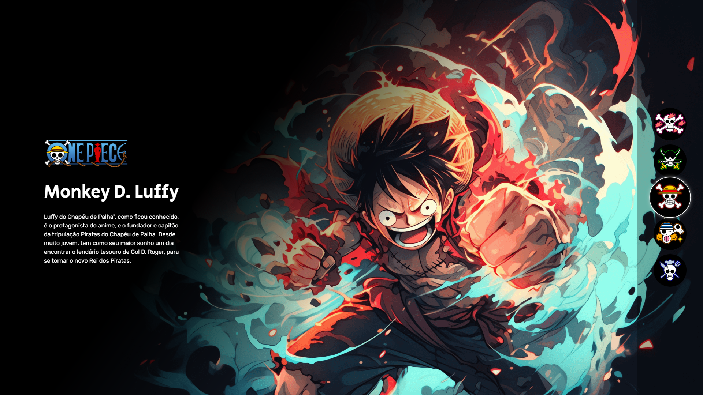

<h1 align="center"> One Piece </h1>

  <a href="#-tecnologias">Tecnologias</a>&nbsp;&nbsp;&nbsp;|&nbsp;&nbsp;&nbsp;
  <a href="#-projeto">Projeto</a>&nbsp;&nbsp;&nbsp;

 

  

## 🚀 Tecnologias

Esse projeto foi desenvolvido com as seguintes tecnologias:

- HTML e CSS
- JavaScript
- Git e Github

## 💻 Projeto

Projeto de seleção de personagens de One Piece com uma descrição respectiva ao personagem selecionado.

- [Acesse o projeto finalizado, online](https://vitojao.github.io/one-piece/)

Feito com ♥ by [vitojaodev](https://vitojao.github.io/devlinks/) :wave: